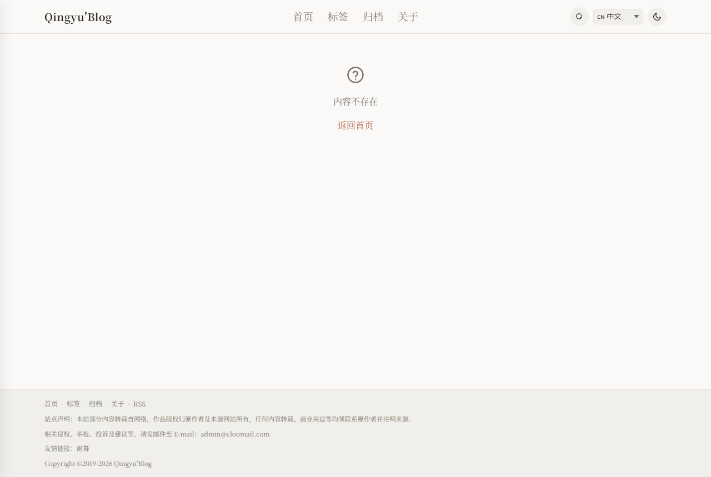

<p align="center">
  
</p>

<h1 align="center">Qingyu'Blog</h1>

<p align="center">
  <b>闆舵鏋?路 闆舵瀯寤?路 闆朵緷璧?鈥斺€?鍙屽嚮 index.html 灏辫兘鐢ㄧ殑涓汉鍗氬</b>
</p>

<p align="center">
  <a href="https://kejiland.azhz.workers.dev">
    
  </a>
  
  
  
</p>

<p align="center">
  <a href="https://github.com/kejiland/blog/stargazers">
    
  </a>
  <a href="https://github.com/kejiland/blog/network/members">
    
  </a>
  <a href="https://github.com/kejiland/blog/issues">
    
  </a>
  <a href="https://github.com/kejiland/blog/pulls">
    
  </a>
</p>

<p align="center">
  
  
  
  
  <a href="https://github.com/kejiland/blog/blob/main/LICENSE">
    
  </a>
</p>

---

## 馃搼 鐩綍

- [馃摉 椤圭洰浠嬬粛](#-椤圭洰浠嬬粛)
- [鉁?浼樼偣](#-浼樼偣)
- [鉁?鐗硅壊鍔熻兘](#-鐗硅壊鍔熻兘)
- [馃殌 閮ㄧ讲鏂瑰紡](#-閮ㄧ讲鏂瑰紡)
- [鈽侊笍 Cloudflare 鏈嶅姟璇存槑](#锔?cloudflare-鏈嶅姟璇存槑)
- [鈿欙笍 閰嶇疆鏂囦欢璇存槑](#锔?閰嶇疆鏂囦欢璇存槑)
- [馃洝锔?瀹夊叏璁捐](#锔?瀹夊叏璁捐)
- [馃И 娴嬭瘯](#-娴嬭瘯)
- [馃柤锔?椤圭洰鎴浘](#锔?椤圭洰鎴浘)
- [馃搫 璁稿彲璇乚(#-璁稿彲璇?

## 馃摉 椤圭洰浠嬬粛

Qingyu'Blog锛堣交璇崥瀹級鏄竴涓?*绾師鐢?JavaScript** 缂栧啓鐨勪釜浜哄崥瀹㈢郴缁燂紝涓嶄緷璧栦换浣曞墠绔鏋讹紙React / Vue / Svelte锛夊拰鏋勫缓宸ュ叿锛圵ebpack / Vite锛夈€?
瀹冩敮鎸佷袱绉嶈繍琛屾ā寮忥細

| 妯″紡 | 璇存槑 | 閫傜敤鍦烘櫙 |
| --- | --- | --- |
| **闈欐€佹ā寮?* | 鍙屽嚮 `index.html` 鍗冲彲浣跨敤锛屾暟鎹瓨娴忚鍣?localStorage | 鏈湴鍐欎綔銆佷复鏃堕瑙?|
| **浜戠妯″紡** | 閮ㄧ讲鍒?Cloudflare Workers + D1锛屾暟鎹瓨浜戠鏁版嵁搴?| 姝ｅ紡鍙戝竷銆佸浜鸿闂?|

鏁翠釜鍗氬鏈綋灏卞湪 `public/` 鐩綍锛氬墠鍙?`index.html` + `style.css` + `app.js` + `posts.js`锛屽悗鍙?`admin.js` + `admin.css`锛屽浗闄呭寲 `i18n.js` + `locales/`銆傛棤闇€浠讳綍绗笁鏂硅繍琛屾椂渚濊禆銆?
> 馃挕 浠撳簱鏍圭洰褰曠殑 `index.html` 鍙槸涓€涓烦杞〉锛屼細鑷姩鎵撳紑 `public/index.html`锛圕loudflare Pages / Workers 鐨勯儴缃茬洰褰曪級銆傛湰鍦板弻鍑?`public/index.html` 鍚屾牱鍙敤銆?
---

## 鉁?浼樼偣

| 浼樼偣 | 璇存槑 |
| --- | --- |
| **闆堕棬妲?* | 涓嶉渶瑕?Node.js銆佷笉闇€瑕?npm銆佷笉闇€瑕佹瀯寤猴紝鍙屽嚮鍗冲彲杩愯 |
| **闆舵垚鏈?* | Cloudflare Workers + D1 鍏嶈垂棰濆害瀹屽叏澶熶釜浜哄崥瀹娇鐢?|
| **闆朵緷璧?* | 涓嶅紩鍏ヤ换浣曠涓夋柟搴擄紝浠ｇ爜閲忓彲鎺э紝鍔犺浇鏋佸揩 |
| **闆堕攣瀹?* | 鏂囩珷鏄?Markdown 鏂囦欢锛岄殢鏃跺彲浠ヨ縼绉诲埌浠讳綍骞冲彴 |
| **鍙岄€氶亾** | 闈欐€佸鍑?+ 浜戠 API锛屽悓涓€浠戒唬鐮佷袱绉嶉儴缃叉柟寮?|
| **鍝嶅簲寮?* | 鍓嶅彴 + 鍚庡彴鍧囨敮鎸佹墜鏈?/ 骞虫澘 / 妗岄潰鍏ㄩ€傞厤 |
| **澶氳瑷€** | 鍐呯疆涓枃 / English / 鏃ユ湰瑾?/ 頃滉淡鞏?/ 啶灌た啶ㄠ啶︵ 浜旇鐣岄潰锛岃嚜鍔ㄨ瘑鍒祻瑙堝櫒璇█ |
| **琛嚎缇庡** | 鍥涚骇琛嚎瀛椾綋鏍堬紙鎬濇簮瀹嬩綋 / 婧愭ǎ鏄庨珨 / 姊︽簮瀹嬩綋 / 鏈遍泙浠垮畫锛夛紝涓枃闃呰鏇存湁娓╁害 |
| **瀹夊叏** | PBKDF2 + AES-GCM 鍔犲瘑锛屽瘑鐮佸搱甯屽瓨鍌紝浼氳瘽浠ょ墝閴存潈锛孫rigin / CORS 鏍￠獙 |

---

## 馃搧 鐩綍缁撴瀯

```
鈹溾攢鈹€ public/                          # 绔欑偣鏈綋锛堥潤鎬佽祫婧愶紝閮ㄧ讲鐩綍锛?鈹?  鈹溾攢鈹€ index.html                   # 椤甸潰鍏ュ彛锛堝弻鍑?/ 閮ㄧ讲璧风偣锛?鈹?  鈹溾攢鈹€ config.js                    # 鍏ㄧ珯閰嶇疆锛堥〉鑴?/ 骞垮憡 / 妯″紡 / 璇█锛?鈹?  鈹溾攢鈹€ style.css                    # 鍓嶅彴鏍峰紡锛堟繁鑹叉ā寮?+ 鍝嶅簲寮?+ 鍥涚骇琛嚎瀛椾綋锛?鈹?  鈹溾攢鈹€ app.js                       # 鍓嶅彴閫昏緫锛堣矾鐢?/ 璇勮 / 鍔犲瘑 / 鎼滅储 / 澶氳瑷€ / 涓婚锛?鈹?  鈹溾攢鈹€ admin.js                     # 鍚庡彴绠＄悊 SPA锛堜华琛ㄧ洏 / 鏂囩珷 / 璇勮 / 璁剧疆锛?鈹?  鈹溾攢鈹€ admin.css                    # 鍚庡彴鏍峰紡锛堝搷搴斿紡甯冨眬锛?鈹?  鈹溾攢鈹€ i18n.js                      # 鍥介檯鍖栨ā鍧楋紙涓?鑻?鏃?闊?鍗板湴锛屽唴缃腑鏂囧厹搴曪級
鈹?  鈹溾攢鈹€ posts.js                     # 闈欐€佹ā寮忔枃绔犳暟鎹紙鐢便€屽鍑?posts.js銆嶇敓鎴愶級
鈹?  鈹溾攢鈹€ locales/                     # 璇█鍖咃紙zh-CN / en / ja / ko / hi锛?鈹?  鈹溾攢鈹€ fonts/dreamserif/            # 鏈湴鍒嗙墖琛嚎瀛椾綋锛堟ⅵ婧愬畫浣?QY-Display锛?鈹?  鈹溾攢鈹€ feed.xml                     # 闈欐€?RSS锛堝彲閫夛紝浜戠鐢?API 鐢熸垚锛?鈹?  鈹溾攢鈹€ sitemap.xml                  # 闈欐€?Sitemap锛堝彲閫夛級
鈹?  鈹溾攢鈹€ robots.txt                   # 鐖櫕瑙勫垯锛堢姝㈡姄鍙栧悗鍙帮紝澹版槑 Sitemap锛?鈹?  鈹斺攢鈹€ _redirects                   # Cloudflare Pages 璺敱锛圫PA 鍥為€€ + /public 閲嶅畾鍚戯級
鈹溾攢鈹€ functions/                       # Cloudflare API锛圥ages Functions / Workers 鍏辩敤锛?鈹?  鈹溾攢鈹€ api/
鈹?  鈹?  鈹溾攢鈹€ posts.js                 # 鏂囩珷 CRUD
鈹?  鈹?  鈹溾攢鈹€ posts/[id]/
鈹?  鈹?  鈹?  鈹溾攢鈹€ index.js             # 鍗曠瘒鏂囩珷锛圙ET / PUT / DELETE锛?鈹?  鈹?  鈹?  鈹溾攢鈹€ comments.js          # 鏂囩珷璇勮锛圙ET / POST锛屾敮鎸佸祵濂楀洖澶嶏級
鈹?  鈹?  鈹?  鈹溾攢鈹€ comments/[cid].js    # 鍗曟潯璇勮鍒犻櫎锛堢鐞嗭級
鈹?  鈹?  鈹?  鈹斺攢鈹€ stats.js             # 闃呰 / 鐐硅禐缁熻
鈹?  鈹?  鈹溾攢鈹€ comments.js              # 鍏ㄥ眬璇勮鍒楄〃锛堢鐞嗗悗鍙帮級
鈹?  鈹?  鈹溾攢鈹€ comments/[id].js         # 璇勮瀹℃牳 / 鍒犻櫎
鈹?  鈹?  鈹溾攢鈹€ media.js                 # 濯掍綋璧勬簮搴?鈹?  鈹?  鈹溾攢鈹€ media/[id].js            # 濯掍綋鍒犻櫎
鈹?  鈹?  鈹溾攢鈹€ settings.js              # 绔欑偣璁剧疆
鈹?  鈹?  鈹溾攢鈹€ site-files/              # 绔欑偣浜х墿锛坒eed.xml / sitemap.xml / posts.js锛?鈹?  鈹?  鈹?  鈹溾攢鈹€ index.js             # 鍒楀嚭 / 淇濆瓨浜х墿
鈹?  鈹?  鈹?  鈹斺攢鈹€ [name].js            # 涓嬭浇浜х墿鍐呭
鈹?  鈹?  鈹溾攢鈹€ admin/
鈹?  鈹?  鈹?  鈹溾攢鈹€ setup.js             # 棣栨璁剧疆瀵嗙爜
鈹?  鈹?  鈹?  鈹溾攢鈹€ login.js             # 瀵嗙爜鐧诲綍
鈹?  鈹?  鈹?  鈹溾攢鈹€ logout.js            # 鐧诲嚭
鈹?  鈹?  鈹?  鈹斺攢鈹€ password.js          # 淇敼瀵嗙爜
鈹?  鈹?  鈹溾攢鈹€ stats/trend.js           # 30 澶╄秼鍔挎暟鎹?鈹?  鈹?  鈹溾攢鈹€ feed.xml.js              # RSS 鐢熸垚
鈹?  鈹?  鈹斺攢鈹€ sitemap.xml.js           # Sitemap 鐢熸垚
鈹?  鈹斺攢鈹€ _lib/
鈹?      鈹斺攢鈹€ api-core.js              # API 鏍稿績閫昏緫锛圖1 + 閴存潈 + 瀹夊叏锛?鈹溾攢鈹€ worker.js                        # Cloudflare Workers 鍏ュ彛锛堣矾鐢卞垎鍙戯級
鈹溾攢鈹€ migrations/                      # D1 鏁版嵁搴撹縼绉伙紙CI 鑷姩鎵ц锛屽箓绛夛級
鈹?  鈹溾攢鈹€ 0001_init.sql                # 鍩虹琛ㄧ粨鏋?鈹?  鈹溾攢鈹€ 0002_site_files.sql          # 绔欑偣鏂囦欢瀛樺偍
鈹?  鈹溾攢鈹€ 0003_cover_column.sql        # 灏侀潰鍥惧瓧娈?鈹?  鈹溾攢鈹€ 0004_post_meta.sql           # 鍒嗙被 / 鍙戝竷鐘舵€?鈹?  鈹溾攢鈹€ 0005_comment_status.sql      # 璇勮瀹℃牳鐘舵€?鈹?  鈹溾攢鈹€ 0006_media.sql              # 濯掍綋璧勬簮琛?鈹?  鈹溾攢鈹€ 0007_settings.sql            # 绔欑偣璁剧疆琛?鈹?  鈹溾攢鈹€ 0008_stats_daily.sql         # 姣忔棩缁熻琛?鈹?  鈹溾攢鈹€ 0009_comment_status_index.sql # 璇勮鐘舵€佺储寮?鈹?  鈹溾攢鈹€ 0010_admin_must_change.sql   # 寮哄埗鏀瑰瘑鏍囪
鈹?  鈹溾攢鈹€ 0011_comment_reply.sql       # 璇勮鍥炲 parent_id 瀛楁
鈹?  鈹斺攢鈹€ 0012_clear_orphaned_nav.sql  # 娓呯悊閬楃暀 nav 閰嶇疆
鈹溾攢鈹€ scripts/
鈹?  鈹斺攢鈹€ migrate-kv-to-d1.mjs         # 涓€娆℃€ц縼绉伙細KV 鏁版嵁 鈫?D1
鈹溾攢鈹€ .github/workflows/
鈹?  鈹溾攢鈹€ deploy.yml                   # GitHub Actions 鑷姩閮ㄧ讲鍒?Workers
鈹?  鈹斺攢鈹€ migrate-kv-to-d1.yml         # 鎵嬪姩瑙﹀彂 KV 鈫?D1 杩佺Щ
鈹溾攢鈹€ seed.js                          # 瀵煎叆绀轰緥鏂囩珷鍒颁簯绔?API
鈹溾攢鈹€ _addtheme.py                     # 鍘嗗彶鑴氭湰锛氭敞鍏ヤ富棰樺垏鎹紙宸插浐鍖栬繘婧愮爜锛屾棤闇€鍐嶈窇锛?鈹溾攢鈹€ wrangler.toml                    # Cloudflare Pages 閰嶇疆
鈹溾攢鈹€ wrangler.workers.toml            # Cloudflare Workers 閰嶇疆
鈹溾攢鈹€ smoke-test.js                    # 鍐掔儫娴嬭瘯
鈹溾攢鈹€ README.md                        # 涓枃璇存槑
鈹斺攢鈹€ README_EN.md                     # 鑻辨枃璇存槑
```

---

## 鉁?鐗硅壊鍔熻兘

### 鍓嶅彴

| 鍔熻兘 | 璇存槑 |
| --- | --- |
| 鐪熷疄璺緞璺敱 | 鏃?hash锛歚/`銆乣/archive`銆乣/about`銆乣/tags`銆乣/posts/<鍒悕>/`銆乣/admin`銆乣/write`锛屽埛鏂颁笉 404 |
| Markdown 鍐欎綔鍙?| 瀹炴椂棰勮銆佸伐鍏锋爮涓€閿彃鍏ャ€佸瓧鏁扮粺璁°€佽崏绋胯嚜鍔ㄤ繚瀛?|
| 鏂囩珷鍔犲瘑 | PBKDF2 + AES-GCM 绔埌绔姞瀵嗭紝姝ｆ枃鍙瓨瀵嗘枃 |
| 璇勮绯荤粺 | 浜戠 D1 鍏ㄥ眬璇勮 + 瀹℃牳妯″紡锛涢潤鎬佹ā寮?localStorage锛涙敮鎸?*宓屽鍥炲** |
| 绔欏唴鎼滅储 | 瀹炴椂鍖归厤鏍囬 / 鏍囩 / 鎽樿 |
| 姝ｆ枃鐩綍 TOC | 鑷姩鐢熸垚銆侀敋鐐硅烦杞紱浠ｇ爜楂樹寒 |
| 闃呰缁熻 | 娴忚鏁?/ 鐐硅禐锛堜簯绔叏灞€ / 闈欐€佹湰鏈猴級 |
| 绮鹃€夋枃绔?| 璇勮鍖轰笅鏂硅嚜鍔ㄦ帹鑽愶紙鐐硅禐脳3 + 娴忚 + 璇勮脳5锛?|
| RSS / Sitemap | 鑷姩鐢熸垚锛屽姞瀵嗘枃绔犺嚜鍔ㄦ帓闄?|
| 涓婁竴绡?/ 涓嬩竴绡?| 鍙湁涓€鏉℃椂鑷姩闅愯棌绌轰綅 |
| 鍗＄墖寮忓垪琛?| 灏侀潰缂╃暐鍥俱€佺疆椤跺窘绔犮€佹爣绛捐创搴?|
| 娣辫壊 / 娴呰壊涓婚 | 涓€閿垏鎹紝澶氭柇鐐瑰搷搴斿紡閫傞厤 |
| 澶氳瑷€鐣岄潰 | 涓枃 / English / 鏃ユ湰瑾?/ 頃滉淡鞏?/ 啶灌た啶ㄠ啶︵锛岃嚜鍔ㄨ瘑鍒?+ 鎵嬪姩鍒囨崲 |
| 鍥涚骇琛嚎瀛椾綋 | 姝ｆ枃鎬濇簮瀹嬩綋 路 绔犺妭鏍囬婧愭ǎ鏄庨珨 路 澶ф爣棰樻ⅵ婧愬畫浣?路 寮曠敤鏈遍泙浠垮畫 |

### 绠＄悊鍚庡彴

| 鍔熻兘 | 璇存槑 |
| --- | --- |
| 浠〃鐩?| 7 椤圭粺璁″崱鐗?+ 30 澶╄闂?/ 璇勮瓒嬪娍鍥?|
| 鏂囩珷绠＄悊 | 鎼滅储 / 鍒嗙被绛涢€?/ 鍒嗛〉 / 缃《鍒囨崲 / 鍔犲瘑鍒囨崲 |
| 缂栬緫鍣?| Markdown 瀹炴椂棰勮 + 鍒嗙被 / 鏍囩 / 灏侀潰 / 缃《 / 鍔犲瘑 |
| 璇勮绠＄悊 | 鍏ㄥ眬璇勮鍒楄〃锛屽鏍?/ 鍒犻櫎锛屽洖澶嶉摼杩借釜 |
| 鍒嗙被 / 鏍囩绠＄悊 | 閲嶅懡鍚?/ 鍒犻櫎锛堟壒閲忔洿鏂版墍鏈夌浉鍏虫枃绔狅級 |
| 濯掍綋璧勬簮搴?| 鍥剧墖涓婁紶锛坆ase64 瀛?D1锛?|
| 鍗氬璁剧疆 | 绔欑偣淇℃伅 / 涓汉璧勬枡 / 瀵艰埅鑿滃崟 |
| 涓€閿鍑?| 鍚屾椂瀵煎嚭 posts.js / feed.xml / sitemap.xml锛岃鐩栧嵆鍙戝竷 |
| 鍝嶅簲寮?| PC 鍥哄畾渚ф爮 / 绉诲姩绔娊灞夊鑸?|

---

## 馃殌 閮ㄧ讲鏂瑰紡

### 鏂瑰紡涓€锛氭湰鍦伴潤鎬?
```bash
git clone https://github.com/kejiland/blog.git
cd blog
```

鍙屽嚮 `public/index.html`锛屾垨鍚姩鏈湴鏈嶅姟鍣細

```bash
# Python
python -m http.server 8080 -d public

# Node.js
npx serve public
```

鎵撳紑 `http://localhost:8080/admin`锛岃缃瘑鐮佸嵆鍙紑濮嬪啓浣溿€?
### 鏂瑰紡浜岋細Cloudflare Workers锛堟帹鑽愶級

#### 1. 鍑嗗宸ヤ綔


- 娉ㄥ唽 [Cloudflare](https://dash.cloudflare.com/sign-up) 璐﹀彿
- 瀹夎 [Wrangler CLI](https://developers.cloudflare.com/workers/wrangler/install-and-update/)锛歚npm install -g wrangler`

#### 2. 鍒涘缓 Cloudflare 璧勬簮

```bash
# 鐧诲綍 Cloudflare
npx wrangler login

# 鍒涘缓 D1 鏁版嵁搴擄紙涓诲瓨鍌細鏂囩珷 / 璇勮 / 缁熻 / 瀵嗙爜锛?npx wrangler d1 create blog
# 璁颁笅杈撳嚭鐨?database_id锛堟槸 UUID锛屼笉鏄暟鎹簱鍚嶏紝涔熶笉鏄?KV 鐨?id锛?
# 鍒涘缓 KV 鍛藉悕绌洪棿锛堝鐢ㄧ粦瀹氾級
npx wrangler kv namespace create BLOG
# 璁颁笅杈撳嚭鐨?id锛?2 浣嶅崄鍏繘鍒讹級
```

#### 3. 閰嶇疆 GitHub Secrets

鍦ㄤ粨搴?Settings 鈫?Secrets and variables 鈫?Actions 涓坊鍔狅細

| Secret | 蹇呭～ | 璇存槑 |
| --- | --- | --- |
| `CLOUDFLARE_API_TOKEN` | 鉁?| Cloudflare API Token锛堥渶瑕?Workers + D1 + KV 鏉冮檺锛?|
| `CLOUDFLARE_ACCOUNT_ID` | 鉁?| Cloudflare 璐︽埛 ID锛堝湪 Dashboard 鍙充晶鍙锛?|
| `BLOG_D1_ID` | 鉁?| D1 鏁版嵁搴?ID锛堜笂涓€姝ュ垱寤鸿幏寰楋紝UUID 鏍煎紡锛?|
| `BLOG_KV_ID` | 鉁?| KV 鍛藉悕绌洪棿 ID锛堜笂涓€姝ュ垱寤鸿幏寰楋紝32 浣嶅崄鍏繘鍒讹級 |
| `BLOG_ADMIN_SETUP_KEY` | 鎺ㄨ崘 | 棣栨璁剧疆绠＄悊鍛樺瘑鐮佺殑涓€娆℃€у瘑閽ワ紙闃叉姠娉級 |
| `SITE_URL` | 鎺ㄨ崘 | 绔欑偣瀵瑰鍩熷悕锛屽 `https://blog.example.com`锛堢敤浜庢敹绱?CORS / RSS / Sitemap锛?|
| `CF_ZONE_ID` | 鍙€?| 鑷畾涔夊煙鍚嶇殑 Zone ID锛堥厤缃悗鍙戝竷鍗虫竻杈圭紭缂撳瓨锛?|

#### 4. 閮ㄧ讲

鎺ㄩ€佸埌 `main` 鍒嗘敮锛孏itHub Actions 浼氳嚜鍔細

1. 鉁?鏍￠獙蹇呰 Secrets
2. 鉁?鎵ц D1 杩佺Щ锛堝缓琛?+ 鍔犲垪锛屾寜搴忓箓绛夛級
3. 鉁?閮ㄧ讲 Worker 鍒?Cloudflare
4. 鉁?鍐欏叆杩愯鏃?Secret锛坄BLOG_ADMIN_SETUP_KEY` 绛夛級

閮ㄧ讲瀹屾垚鍚庤闂?`https://<worker鍚?.<瀛愬煙>.workers.dev/admin`锛?- 鑻ラ厤缃簡 `BLOG_ADMIN_SETUP_KEY`锛岄娆＄敤璇ュ瘑閽ヨ缃鐞嗗憳瀵嗙爜锛?- 鍚﹀垯绯荤粺鑷姩鐢熸垚闅忔満榛樿瀵嗙爜锛岀櫥褰曞悗寮哄埗淇敼銆?
#### 5. 浠?KV 杩佺Щ鍒?D1锛堟棫鏁版嵁锛?
鑻ヤ綘姝ゅ墠浣跨敤 KV 鍗?key 瀛樺偍锛屽彲鎵嬪姩杩愯杩佺Щ宸ヤ綔娴佹妸绾夸笂鏁版嵁鎼埌 D1锛?
```bash
# 鏈湴鎵ц锛堥渶 CLOUDFLARE_ACCOUNT_ID / CLOUDFLARE_API_TOKEN / BLOG_KV_ID / BLOG_D1_ID锛?node scripts/migrate-kv-to-d1.mjs --dry-run   # 浠呴瑙?SQL
node scripts/migrate-kv-to-d1.mjs             # 姝ｅ紡鍐欏叆 D1
```

鎴栧湪浠撳簱 Actions 鏍囩椤垫墜鍔ㄨЕ鍙?`Migrate KV to D1` 宸ヤ綔娴侊紙浠撳簱 Secrets 鑷姩娉ㄥ叆锛屾敮鎸?`dry-run` / `migrate` 涓ょ妯″紡锛夈€?
---

## 鈽侊笍 Cloudflare 鏈嶅姟璇存槑

### Workers

Workers 鏄?Cloudflare 鐨勮竟缂樿绠楀钩鍙帮紝鏈」鐩敤瀹冭繍琛屽悗绔?API锛?
- **鍏ュ彛鏂囦欢**锛歚worker.js`锛堣矾鐢卞垎鍙戯級+ `functions/`锛圥ages Functions锛?- **闈欐€佽祫婧?*锛歚public/` 鐩綍閫氳繃 Workers 鐨?`[assets]` 缁戝畾鑷姩鎻愪緵
- **鍏煎鎬ф棩鏈?*锛歚2025-02-01`

**wrangler.workers.toml 鍏抽敭閰嶇疆**锛?
```toml
name = "kejiland"
main = "worker.js"

[assets]
directory = "./public"
binding = "ASSETS"
not_found_handling = "single-page-application"  # SPA 鍥為€€
html_handling = "auto-trailing-slash"

[[kv_namespaces]]
binding = "BLOG"
id = "{env.BLOG_KV_ID}"

[[d1_databases]]
binding = "DB"
database_name = "blog"
database_id = "{env.BLOG_D1_ID}"
```

### KV锛圞ey-Value 瀛樺偍锛?
KV 鐢ㄤ簬澶囩敤缁戝畾锛堝凡鍩烘湰琚?D1 鍙栦唬锛夛紝褰撳墠鐢ㄩ€旓細

| 鐢ㄩ€?| 璇存槑 |
| --- | --- |
| 鐐硅禐鍘婚噸 | `liked:{ip}:{postId}` 鈫?闃插埛璧?|
| 绔欑偣鏂囦欢缂撳瓨 | feed.xml / sitemap.xml / posts.js 缂撳瓨 |
| 缂撳瓨娓呴櫎鏍囪 | `purge:{tag}` 鈫?鐗堟湰鎺у埗 |

> 鈿狅笍 KV 鏄?*鏈€缁堜竴鑷存€?*锛堝叏鐞冧紶鎾湁寤惰繜锛夛紝涓嶉€傚悎闇€瑕佸己涓€鑷存€х殑鍦烘櫙銆侱1 鏄?SQLite锛屾彁渚涘己涓€鑷存€с€?
### D1锛圫QLite 鏁版嵁搴擄級

D1 鏄?Cloudflare 鐨勮竟缂?SQLite 鏁版嵁搴擄紝鏈」鐩殑**涓诲瓨鍌?*锛?
| 琛?| 璇存槑 | 鍏抽敭瀛楁 |
| --- | --- | --- |
| `posts` | 鏂囩珷 | id, title, content, cover, pinned, protected, enc, tags, category, status |
| `comments` | 璇勮 | id, post_id, author, content, date, status (approved/pending), **parent_id**锛堝洖澶嶏級 |
| `stats` | 闃呰/鐐硅禐 | post_id, views, likes |
| `admin_auth` | 绠＄悊鍛樺瘑鐮?| k, salt, hash, iter, must_change |
| `admin_sessions` | 鐧诲綍浼氳瘽 | token, exp |
| `admin_fails` | 鐧诲綍闄愭祦 | ip, n, until |
| `media` | 濯掍綋璧勬簮 | id, name, url, type, size |
| `site_settings` | 绔欑偣璁剧疆 | k, v锛堥敭鍊煎锛?|
| `site_files` | 绔欑偣浜х墿 | name, content, updated_at锛坒eed/sitemap/posts.js锛?|
| `stats_daily` | 姣忔棩缁熻 | post_id, date, views, likes |

---

## 鈿欙笍 閰嶇疆鏂囦欢璇存槑

### config.js

```javascript
window.BLOG_CONFIG = {
  // ====== 鍩虹閰嶇疆 ======
  mode: 'auto',           // 'auto' | 'static' | 'api'
  apiBase: '',            // API 鍩虹鍦板潃锛岀暀绌?= 鍚屾簮
  siteUrl: '',            // 绔欑偣瀵瑰鍦板潃锛圧SS/Sitemap 鐢級
  writeToken: '',         // 鏃х増闈欐€佷护鐗岋紙寤鸿鐢ㄧ櫥褰曟浛浠ｏ級
  pageSize: 5,            // 棣栭〉姣忛〉鏂囩珷鏁帮紙0 = 涓嶅垎椤碉級
  adminPwd: '',           // 闈欐€佹ā寮忔湰鍦板瘑鐮侊紙浜戠妯″紡璇风暀绌猴級

  // 瀵艰埅椤圭粺涓€鍦?public/app.js 鐨?NAV 鏁扮粍涓畾涔夛紙鍗曚竴鏁版嵁婧愶紝鏃犻渶鍦ㄦ閰嶇疆锛?
  // ====== 椤佃剼閰嶇疆 ======
  footer: {
    text: '',
    icp: '',               // 澶囨鍙?    contact: [],           // 鑱旂郴鏂瑰紡
    links: [],             // 鍙嬫儏閾炬帴
    decl: '',              // 绔欑偣澹版槑
    email: '',             // 鑱旂郴閭
    startYear: 2019,       // 鐗堟潈璧峰骞?    copyrightName: "Qingyu'Blog"
  },

  // ====== 骞垮憡浣?======
  ads: {
    enabled: false,
    belowSearch: '',       // 棣栭〉鍒楄〃涓婃柟
    between: '',           // 鍒楄〃闂撮殧鎻掑叆
    betweenEvery: 3,       // 姣?N 绡囨彃鍏?    content: ''            // 鏂囩珷璇︽儏搴曢儴
  }
};
```

### mode 璇存槑

| 鍊?| 琛屼负 |
| --- | --- |
| `'auto'` | **鎺ㄨ崘**銆傝嚜鍔ㄦ娴嬶細璇锋眰 `/api/posts` 鎴愬姛 鈫?浜戠锛涘け璐?鈫?闈欐€?|
| `'static'` | 寮哄埗闈欐€佹ā寮忥紝鍙敤 posts.js |
| `'api'` | 寮哄埗浜戠妯″紡锛岄渶瑕佸悗绔?API |

### 澶氳瑷€锛坕18n锛?
`i18n.js` 鍐呯疆 5 绉嶈瑷€锛堜腑鏂?/ English / 鏃ユ湰瑾?/ 頃滉淡鞏?/ 啶灌た啶ㄠ啶︵锛夛紝榛樿鎸夋祻瑙堝櫒 `navigator.language` 鑷姩璇嗗埆锛屽苟鎻愪緵鎵嬪姩鍒囨崲銆傝瑷€鍖呮斁鍦?`public/locales/<lang>.json`锛堜腑鏂囧悓鏃跺唴宓屽厹搴曪紝纭繚 `file://` 鏈湴棰勮鏃舵牳蹇冩枃瀛楀缁堝彲璇伙級銆?
---

## 馃洝锔?瀹夊叏璁捐

| 灞?| 鏈哄埗 |
| --- | --- |
| 瀵嗙爜瀛樺偍 | PBKDF2-SHA256 鍔犵洂鍝堝笇锛?00,000 娆¤凯浠ｏ級锛屾案涓嶅瓨鏄庢枃 |
| 棣栨閮ㄧ讲 | 鑷姩鐢熸垚闅忔満榛樿瀵嗙爜锛堟垨 `BLOG_ADMIN_SETUP_KEY` 璁惧瘑锛夛紝鐧诲綍鍚庡己鍒朵慨鏀?|
| 闈欐€佹ā寮?| 瀵嗙爜 SHA-256 鍝堝笇瀛樺偍锛堝吋瀹规棫鏄庢枃锛岀櫥褰曞悗鑷姩鍗囩骇锛?|
| 浼氳瘽绠＄悊 | 闅忔満 Token锛?2 瀛楄妭 hex锛夛紝7 澶╂湁鏁堬紝鐧诲嚭鍗抽攢姣?|
| 闄愭祦 | 鍚屼竴 IP 杩炵画澶辫触 5 娆￠攣瀹?15 鍒嗛挓 |
| 鏂囩珷鍔犲瘑 | PBKDF2 + AES-GCM 绔埌绔姞瀵嗭紝瀵嗘枃鍙瓨鏈嶅姟绔?|
| 璇勮瀹夊叏 | XSS 杞箟 + SQL 娉ㄥ叆鍙傛暟鍖?+ 姣?IP 棰戠巼闄愬埗 + Origin 鏍￠獙 |
| 鎺ュ彛杈圭晫 | 鏈煡 /api/* 杩斿洖 JSON 404锛岀粷涓嶅洖閫€鍒?index.html |
| CORS | 閰嶇疆 `SITE_URL` 鍚庝粎鍏佽鏈珯鏉ユ簮锛屾湭閰嶇疆鍥為€€涓哄洖鏄炬潵婧?|

---

## 馃И 娴嬭瘯

```bash
node smoke-test.js
```

瑕嗙洊 Markdown 娓叉煋銆乀OC銆佷唬鐮侀珮浜€佸鍏ュ鍑恒€佺鐞嗛棬绂併€佺疆椤躲€佸綊妗ｃ€佹爣绛俱€佽瘎璁哄畨鍏ㄣ€佸姞瀵嗐€佺粺璁°€佹悳绱€丷SS銆丼itemap銆佷簯绔?API銆佺紦瀛樼瓑銆?
瀵煎叆绀轰緥鏂囩珷鍒板凡閮ㄧ讲鐨勪簯绔疄渚嬶細

```bash
node seed.js https://your-blog.workers.dev [--token <浼氳瘽鎴栧啓鍏ヤ护鐗?]
```

---

## 馃柤锔?椤圭洰鎴浘

| 棣栭〉锛堟祬鑹诧級 | 鏂囩珷璇︽儏 | 鍐欎綔鍙?|
| --- | --- | --- |
|  |  | 

---

<p align="center">
  濡傛灉 Qingyu'Blog 瀵逛綘鏈夊府鍔╋紝娆㈣繋 猸?Star / Fork锛屾垨鍒?<a href="https://github.com/kejiland/blog/issues">Issues</a> 鎻愬缓璁€?</p>

<p align="center">
  <b>濡傛灉浣犺寰椾笉閿欙紝璇风粰涓?猸?Star 鏀寔涓€涓嬶紒杩欎細甯姪鏇村浜哄彂鐜拌繖涓」鐩€?/b>
</p>

<!-- Topics: blog, personal-blog, vanilla-js, no-framework, no-dependency, static-site, cloudflare-workers, cloudflare-d1, markdown-blog, javascript, zero-build, lightweight, responsive-design, dark-theme, i18n, end-to-end-encryption, open-source, self-hosted, serif-font, cloudflare-pages -->