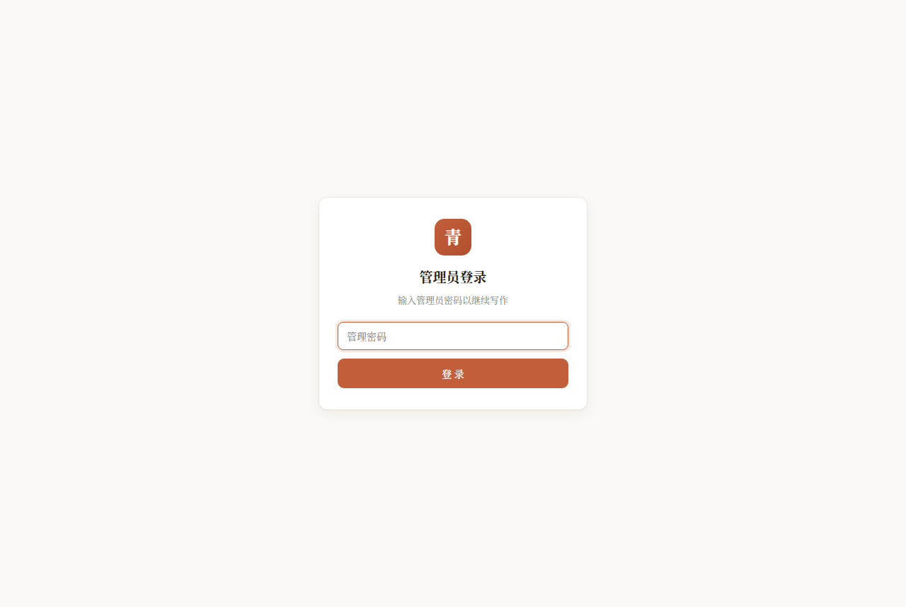
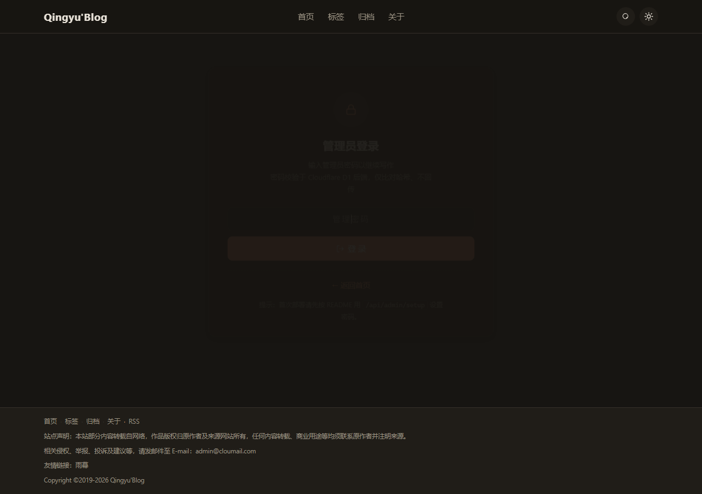
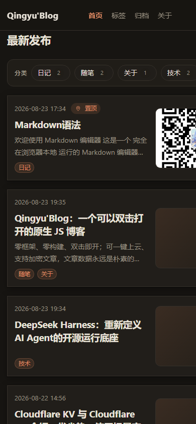

# Qingyu'Blog · A native-JS blog you can open by double-clicking

> Zero framework · Zero build step · Zero dependency — a personal blog that **works by double-clicking `index.html`**, or deploy to Cloudflare for free cloud hosting.
>
> 🚀 Live demo: **[kejiland.azhz.workers.dev](https://kejiland.azhz.workers.dev)**

---

## Why you should try it

Most blogging tools require Node + build steps (Hexo / Hugo) or a server + database (WordPress / CMS). **Qingyu'Blog is different**:

```
📂 The entire blog = one folder = core 4 files
   index.html + style.css + app.js + posts.js
   └─ Admin panel: admin.js + admin.css (responsive SPA)
```

- ✅ **Double-click to open**: download, double-click `index.html`, start reading & writing — fully offline, no `npm install`
- ✅ **Free cloud hosting**: deploy to Cloudflare Workers + D1 (free tier), auto-deployed on every `git push`
- ✅ **Feature-complete**: editor / comments / encryption / search / tags / archive / RSS / read stats / featured articles — all built in
- ✅ **Responsive admin panel**: fixed sidebar on desktop, drawer on mobile, six sections (Dashboard / Posts / Comments / Categories & Tags / Media / Settings)
- ✅ **Vanilla tech**: pure HTML/CSS/JS + native Web APIs (Web Crypto, localStorage) — no framework at all
- ✅ **Your data, your rules**: posts are plain Markdown files, portable forever, never locked into a platform

---

## ✨ Features

### 📝 Writing & Publishing

- **Markdown editor**: live preview, one-click toolbar inserts, word count, autosaved drafts (survive closing the tab)
- **Dual publishing**: static mode exports `posts.js` + `feed.xml` + `sitemap.xml` in one click; cloud mode one-click "Publish to Cloud", instantly visible everywhere
- **Import .md**: supports `---` frontmatter (title / date / tags / excerpt / password)
- **List management**: toggle **pin / encrypt / delete** directly from the post list, no editor needed
- **Category management**: assign one category per article, rename / delete across all articles
- **Tag management**: assign multiple tags per article, rename / delete across all articles

### 🔒 Privacy & Security

- **Article encryption**: PBKDF2 + AES-GCM end-to-end; only ciphertext is stored (hidden from list APIs too); lock-screen reading with a password
- **Admin security**: passwords stored as PBKDF2-SHA256 salted hashes; 7-day session tokens; 5 failed attempts = 15-min IP lockout; auto-generated random default password on first deploy with forced password change
- **Static mode hashing**: local passwords stored as SHA-256 hashes (backward-compatible with old plaintext, auto-upgraded on login)
- **Comment security**: full HTML escaping (anti-XSS), parameterized queries (anti-SQLi), per-IP rate limiting, Origin validation, control-character scrubbing, length caps, token-protected admin deletion

### 💬 Comments

- Cloud **D1 global comments** (shared across all visitors), with moderation support (new comments auto-approved by default)
- Static mode stores comments in browser localStorage
- Consistent mobile & desktop experience

### 🧭 Reading Experience

- **Card list**: cover thumbnails (custom image / first image in body / themed placeholder), pin badge, tags pinned to the bottom
- **Responsive**: dark/light theme toggle, multi-breakpoint mobile adaptation (OPPO / Xiaomi / vivo / Huawei / iPhone)
- **Instant detail pages**: local cache + SWR background refresh — second visits open instantly
- **Site search**: expandable in the top bar, live matching of title / tags / excerpt
- **TOC**: auto-generated table of contents with anchor jumps; syntax highlighting for js / ts / python / bash / css / html / json
- **Read stats**: views / likes (cloud-global or local)
- **Featured articles**: auto-recommends top 2 articles below comments, ranked by engagement (likes×3 + views + comments×5)
- **Archive / tag cloud / prev-next / copy-link**: all there
- **Prev-next navigation**: hides the empty slot when only one direction exists

### 📡 Distribution

- **RSS + Sitemap** auto-generated (encrypted posts excluded), great for subscribers & search engines
- **Custom nav / footer / ad slots**: all driven by `config.js` — change config, not code
- Footer nav adapts to login state: regular users see RSS, admins see the editor link

### 🖥️ Admin Panel

- **Dashboard**: 7 stat cards + 30-day views/comments trend charts
- **Post management**: search / category filter / pagination, one-click pin/encrypt toggle
- **Editor**: Markdown live preview + category / tags / cover / pin / encrypt settings
- **Comment management**: global comment list with approve / delete
- **Media library**: image upload (base64 to D1), preview, copy link
- **Blog settings**: site info / profile / navigation menu (visual editor + JSON dual mode)
- **Responsive layout**: fixed sidebar on desktop, drawer navigation on mobile (992 / 640 / 420 breakpoints)

---

## 🖼️ Screenshots

| Home (desktop) | Article (desktop) | Editor |
| --- | --- | --- |
|  |  |  |

| Admin (editor view) | Admin (login gate) | Home (mobile) |
| --- | --- | --- |
|  |  |  |

> Real screenshots of the site. Try it now: <https://kejiland.azhz.workers.dev>

---

## 🚀 Quick Start

### Option 1: Local static (30-second demo, zero deployment)

```bash
git clone https://github.com/kejiland/blog.git
# or download the ZIP
```

Double-click `public/index.html` → click "✏️ Write" → set a password (≥4 chars) → start writing.

> In static mode there is no backend: "publish" = use the "Export All" button in the editor to download `posts.js` + `feed.xml` + `sitemap.xml`, place them in `public/` to overwrite the old files.

### Option 2: Deploy to Cloudflare (recommended, free)

1. Fork this repo to your GitHub
2. On Cloudflare, create a **D1 database** `blog` (primary storage) + a **KV namespace** `BLOG` (backup binding)
3. Add repo Secrets: `BLOG_D1_ID`, `BLOG_KV_ID`, `CLOUDFLARE_API_TOKEN`, `CLOUDFLARE_ACCOUNT_ID`
4. Push to `main` → GitHub Actions auto-runs: create tables → deploy
5. Open `https://<your-domain>/admin` → first login auto-initializes a random default password → forced password change on login

**Secrets overview**:

| Secret | Purpose |
| --- | --- |
| `BLOG_D1_ID` | D1 database ID (UUID, primary storage) |
| `BLOG_KV_ID` | KV namespace ID (backup binding) |
| `CLOUDFLARE_API_TOKEN` | Cloudflare API token (Workers / KV / D1 access) |
| `CLOUDFLARE_ACCOUNT_ID` | Cloudflare account ID |

> `BLOG_ADMIN_SETUP_KEY` is no longer required. The system auto-generates a random default password on first deploy and forces a password change on login.

---

## 🧰 Tech Stack

| Layer | Tech |
| --- | --- |
| Frontend | Vanilla JavaScript (ES5-style, zero framework, zero dependency) |
| Admin Panel | Vanilla JS responsive SPA (admin.js + admin.css) |
| Cloud | Cloudflare Workers + D1 (SQLite) + KV (backup) |
| Deploy | GitHub Actions auto-deploy (push to go live) |
| Encryption | PBKDF2 + AES-GCM (browser-native Web Crypto) |
| Data | Markdown files (local) / D1 (cloud), dual channel |

---

## 🗂️ Project Structure

```
├── public/                      # The site itself (static assets)
│   ├── index.html               # Page shell (double-click / deploy entry)
│   ├── config.js                # All site config (nav / footer / ads …)
│   ├── style.css                # Frontend styles (dark mode + responsive)
│   ├── app.js                   # Frontend logic (routing / editor / comments / search …)
│   ├── admin.js                 # Admin panel SPA (dashboard / posts / comments / settings)
│   ├── admin.css                # Admin styles (responsive layout + dark theme)
│   └── posts.js                 # Static-mode post data (Markdown)
├── functions/                   # Cloudflare API (shared by Pages Functions / Workers)
│   ├── api/                     # Routes: posts / comments / media / settings / admin / feed / sitemap
│   └── _lib/api-core.js         # API core (D1 storage + auth + security)
├── worker.js                    # Cloudflare Workers entry
├── migrations/                  # D1 schema (applied automatically by CI)
│   ├── 0001_init.sql            # Base tables (posts / comments / stats / admin_auth …)
│   ├── 0002_site_files.sql      # Site file storage
│   ├── 0003_cover_column.sql    # Cover image field
│   ├── 0004_post_meta.sql       # Category / status fields
│   ├── 0005_comment_status.sql  # Comment moderation status
│   ├── 0006_media.sql           # Media library table
│   ├── 0007_settings.sql        # Site settings table
│   ├── 0008_stats_daily.sql     # Daily stats table
│   ├── 0009_comment_status_index.sql # Comment status index
│   └── 0010_admin_must_change.sql    # Forced password change flag
├── .github/workflows/deploy.yml # Auto-deploy
├── smoke-test.js                # Smoke tests (node smoke-test.js)
└── README.md / README_EN.md     # Docs (CN / EN)
```

---

## 🧪 Tests

```bash
node smoke-test.js   # Regression tests, zero dependencies
```

Covers: Markdown rendering / TOC / syntax highlighting / import-export / admin gate / pinning / archive / tags / comments (incl. security hardening) / encryption / stats / search / RSS / Sitemap / cloud APIs / caching.

---

## 🛡️ Security at a Glance

- **Admin passwords**: PBKDF2-SHA256 salted hashes (100,000 iterations), never stored in plaintext
- **First deploy**: auto-generated random default password (8 chars), forced change on first login
- **Static mode**: passwords stored as SHA-256 hashes (backward-compatible with old plaintext, auto-upgraded)
- **Write operations**: all require `Authorization: Bearer` session tokens, otherwise 401
- **Comments**: full XSS escaping · parameterized queries · per-IP rate limit (5/min) · Origin validation · control-character scrubbing · length caps
- **Encryption**: only ciphertext is stored, list APIs hide ciphertext, encrypted posts excluded from RSS
- **Secrets**: all via GitHub Secrets, never committed to the repo

---

## 📄 License

[MIT](LICENSE)

---

*If Qingyu'Blog helps you, feel free to ⭐ Star / Fork, or open an [Issue](https://github.com/kejiland/blog/issues).*
