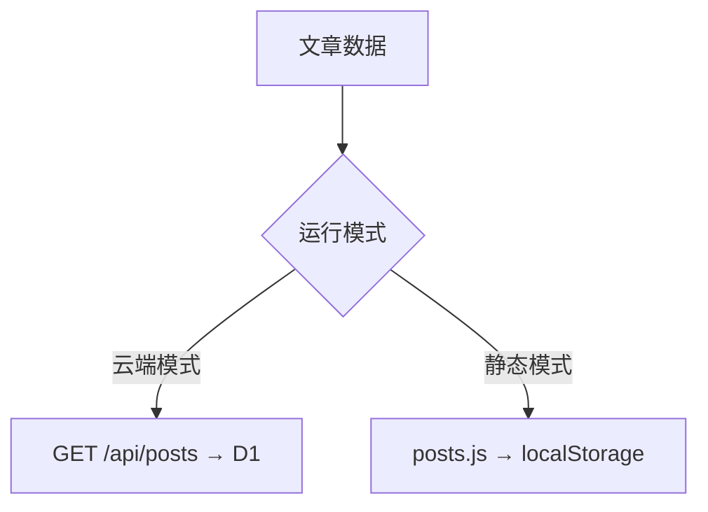

## 方式一：双击打开

直接双击 `public/index.html`，浏览器自动加载博客。

<Warning>
`file://` 协议下部分功能受限：
- 语言包 JSON 可能无法加载（浏览器安全策略）
- 后台管理功能正常（使用 localStorage）
</Warning>

## 方式二：本地服务器

<Tabs>
  <Tab title="Python">
    ```bash
    python -m http.server 8080 -d public
    ```
  </Tab>
  <Tab title="Node.js">
    ```bash
    npx serve public
    ```
  </Tab>
  <Tab title="PHP">
    ```bash
    php -S localhost:8080 -t public
    ```
  </Tab>
</Tabs>

打开 `http://localhost:8080` 即可访问。

## 数据流



## 导出发布

在后台管理（`/admin`）中：

1. 点击「导出 posts.js」→ 生成文章数据
2. 点击「导出 feed.xml」→ 生成 RSS
3. 点击「导出 sitemap.xml」→ 生成 Sitemap
4. 将文件上传到静态托管

## 适合场景

| 场景 | 推荐度 |
|------|--------|
| 本地写作/预览 | ⭐⭐⭐⭐⭐ |
| 个人学习/测试 | ⭐⭐⭐⭐⭐ |
| 纯静态博客（无评论） | ⭐⭐⭐⭐ |
| 需要多人评论 | ❌ 用云端模式 |
